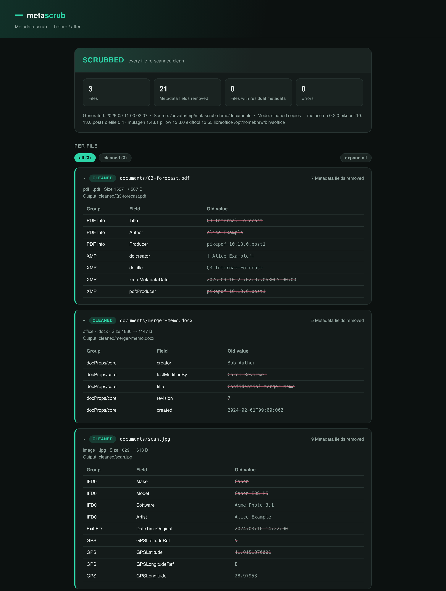
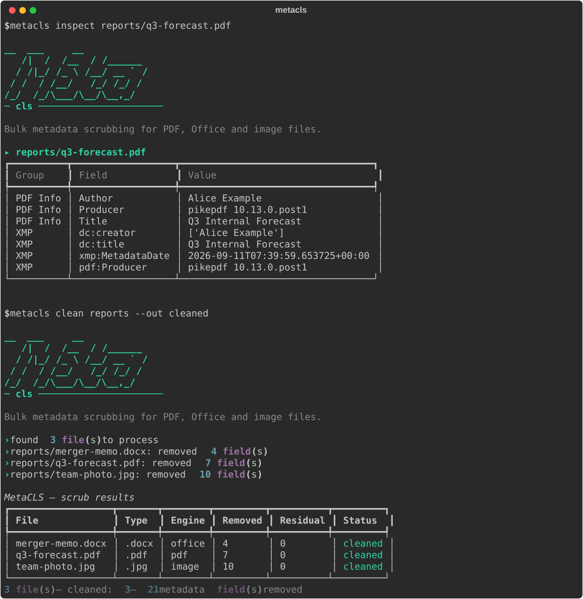
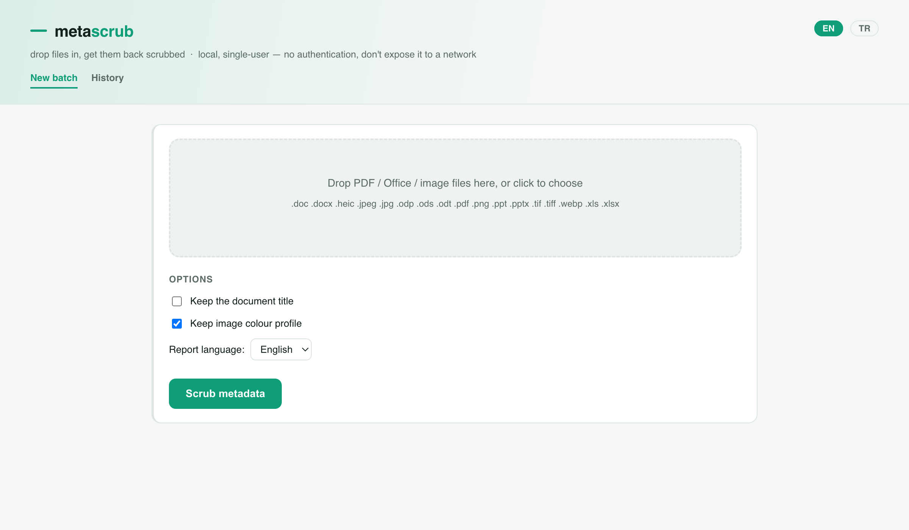

<p align="center">
  
</p>

<p align="center">
  
  
  
  
</p>

<p align="center">
  Bulk metadata scrubbing for PDF, Office and image files.<br>
  Strip the metadata, keep the document — with a before/after proof report.
</p>

<p align="center">
  <sub>Pairs with <a href="https://github.com/gorkemguler/MetaScout">MetaScout</a>: MetaScout <i>finds</i> the leaks, MetaScrub <i>fixes</i> them.</sub>
</p>

<p align="center"><sub>🇬🇧 English · <a href="README.tr.md">🇹🇷 Türkçe</a></sub></p>

<p align="center">
  
</p>

---

## What is this?

An organisation runs MetaScout against its own site and finds a pile of published PDFs and
Office documents leaking author names, internal file paths, software/OS fingerprints and GPS
coordinates. Now someone has to actually **clean those files**. That's MetaScrub.

Point it at a folder (or drag files into the web UI, or POST them to the API) and it:

1. **scans** every supported file for embedded metadata,
2. **strips** it — aggressively by default — writing cleaned copies (originals untouched) or
   overwriting in place,
3. **verifies** each cleaned file by re-scanning it, and
4. **reports** exactly what was removed, per file, as JSON and a styled HTML page you can hand
   to a security team as evidence.

It only touches **metadata** — the document's visible content (body text, images, a scanned
signature) is never modified.

## What it removes

| Format | Engine | Removed |
| --- | --- | --- |
| **PDF** | [pikepdf](https://github.com/pikepdf/pikepdf) (QPDF) | `/Info` dictionary (Author, Title, Producer, Creator, CreationDate, …), the XMP metadata packet, `/PieceInfo` and other application-private data, page-level metadata, annotation authors + timestamps (`/T` `/M` `/CreationDate`), and the description + timestamps on embedded-file attachments. The file is **fully rewritten**, so values sitting in superseded cross-reference sections can't be recovered from the output. Encrypted PDFs need `--password`. |
| **Office** `.docx .xlsx .pptx` | stdlib `zipfile` | `docProps/core.xml` (creator, lastModifiedBy, revision, timestamps), `docProps/app.xml` (Company, Manager, Template path), `docProps/custom.xml`, the embedded thumbnail, and Word revision-save-id fingerprints (`w:rsids`) from `settings.xml`. Dangling relationships and content-type overrides are pruned; per-member zip timestamps are normalised. |
| **OpenDocument** `.odt .ods .odp` | stdlib `zipfile` | `meta.xml` — initial-creator, creator, generator, editing-cycles/duration, timestamps, document statistics, user-defined fields. |
| **Legacy Office** `.doc .xls .ppt` | `olefile` (pure Python) | The `\x05SummaryInformation` / `\x05DocumentSummaryInformation` property streams — author, last-saved-by, company, manager, template, title, timestamps, custom properties — are patched out **in place**: same file size, same format, same structure. `--in-place` works. If a container can't be parsed, MetaScrub falls back to a LibreOffice (`soffice`) re-render to `.docx/.xlsx/.pptx`. |
| **SVG** `.svg` | stdlib `xml` | `<metadata>` (RDF/Dublin-Core author/title/licence), `sodipodi:` / `inkscape:` / Adobe-Illustrator elements and attributes, and editor comments (`<!-- Created with … -->`). The drawing itself is untouched. |
| **Images** `.jpg .jpeg .png .tif .tiff .heic .webp` | [ExifTool](https://exiftool.org) | All EXIF / IPTC / XMP / GPS / MakerNotes and PNG/WebP text chunks. The ICC colour profile and EXIF orientation are kept by default so the picture still renders correctly (`--no-keep-color-profile` / `--no-keep-orientation` to drop those too). |

`--keep Title` (repeatable) spares a named field from the otherwise-aggressive strip.
`--backup` keeps `<name>.orig` next to an `--in-place` scrub.

Two **opt-in** flags go past metadata into identity data that's technically content:
`--strip-form-values` blanks PDF form-field values (`/V` `/DV`) and their cached appearance;
`--strip-office-authors` blanks Office tracked-change / comment **author names and dates**
(the change and comment text stays, so accept/reject still works).

## Install

```bash
pip install metascrub                     # core: PDF + Office scrubbing
pip install 'metascrub[api]'              # + the REST API service
pip install 'metascrub[image-fallback]'   # + Pillow (weak image fallback if exiftool is absent)
```

Image scrubbing needs the **exiftool** binary on `PATH`:

```bash
brew install exiftool                        # macOS
sudo apt install libimage-exiftool-perl      # Debian / Ubuntu
```

PDF, Office (modern **and** legacy `.doc/.xls/.ppt`), ODF and SVG scrubbing are pure Python
and need nothing extra. **LibreOffice** (`soffice`) is only used as a fallback for a legacy
container the in-place patcher can't parse.

> Python 3.10+ is supported. On a brand-new Python where `pikepdf` has no wheel yet, install
> under 3.12 instead.

## CLI

<p align="center">
  
</p>

### Inspect — see what's in the files (read-only)

```bash
metascrub inspect ./published-docs
metascrub inspect leak.pdf report.docx --json
```

Run this on the files MetaScout flagged to see exactly what they carry before you scrub.

### Clean

```bash
# default: originals untouched, cleaned copies written under ./metascrub_cleaned/,
# mirroring the input tree, plus report.json + report.html
metascrub clean ./published-docs

# overwrite the originals instead (asks first; -y to skip the prompt)
metascrub clean ./published-docs --in-place

# preview only, change nothing
metascrub clean ./published-docs --dry-run

# keep document titles, Turkish report
metascrub clean ./published-docs --keep Title --report-lang tr

# just some files
metascrub clean a.pdf b.docx c.jpg --out ./clean
```

Useful flags: `--filetypes`, `--no-recursive`, `--out DIR`, `--keep FIELD`, `--dry-run`,
`--no-verify`, `--no-keep-color-profile`, `--no-keep-orientation`, `--report-lang en|tr`,
`--password` (encrypted PDFs — the cleaned copy is written unencrypted),
`--strip-pdf-id` (fresh random `/ID` per run), `--backup` (keep `<name>.orig` with `--in-place`),
`--strip-form-values`, `--strip-office-authors` (opt-in — see above).

**Exit codes** (so it works as a CI gate): `0` clean · `1` a file errored · `2` a cleaned file
still carried metadata on the verify re-scan.

## Web UI

```bash
metascrub web           # opens http://127.0.0.1:8770/
```

Drag files onto the page, get them back scrubbed — individually or as a zip — with a
per-file before/after view and the full report. Past runs are listed under **History**.
Local, single-user, **no authentication** — don't expose it to a network.

<p align="center">
  
</p>

## REST API

For a Linux server, an FTP drop-box, or a CI pipeline that needs to hand files off to be
cleaned:

```bash
pip install 'metascrub[api]'
metascrub api           # http://127.0.0.1:8000/  ·  interactive docs at /docs
```

```bash
# submit
curl -sS -X POST http://127.0.0.1:8000/v1/clean \
  -F files=@leak.pdf -F files=@report.docx -F report_lang=en
# -> {"job_id": "...", "links": {...}}

# poll
curl -sS http://127.0.0.1:8000/v1/clean/<job_id>

# pull the cleaned files + report as a zip
curl -sSL -o cleaned.zip http://127.0.0.1:8000/v1/clean/<job_id>/download
```

Jobs run in a bounded background thread pool; `--max-workers` / `--max-pending` size it.
There is **no built-in authentication** — run it behind a reverse proxy with an API key /
mTLS, or on a private (Tailscale/WireGuard) network only.

## Docker

```bash
docker build -t metascrub .

# web UI
docker run --rm -p 127.0.0.1:8770:8770 -v "$(pwd)/metascrub_cleaned:/data" metascrub

# REST API
docker run --rm -p 127.0.0.1:8000:8000 -v "$(pwd)/metascrub_cleaned:/data" metascrub \
  api --host 0.0.0.0 --port 8000 --output-dir /data

# one-off: scrub a mounted folder
docker run --rm -v "$(pwd)/docs:/work" metascrub clean /work --out /work/cleaned
```

Or `docker compose up --build` (web UI); `docker compose --profile api up metascrub-api` (API).

## How thorough is it?

- **PDF** — a full QPDF rewrite, not an incremental update, so the removed `/Info` and XMP
  aren't left behind in an old xref section. Annotation authors/dates and embedded-file
  metadata go too; the annotation's visible text and the attached file itself stay.
  **Signed PDFs are skipped, not broken** — scrubbing would invalidate the signature;
  re-export an unsigned copy if you need it cleaned. **Encrypted PDFs** without `--password`
  are skipped; with it, the cleaned copy is written unencrypted (the result says so).
- **Office / ODF** — the metadata parts are deleted from the package (or, for ODF, emptied),
  not merely blanked, and the references to them are pruned so nothing dangles.
- **Images** — `exiftool -all=`, which is the reference tool for this.
- **`--verify`** (on by default) re-scans every cleaned file and lists anything still present
  in the report; the CLI exits `2` if so.

### Limitations

- Content is out of scope by design: text in the document body, a visible/scanned signature,
  text baked into an image — MetaScrub won't touch those. (MetaScout's `--scan-content` finds
  them; removing them is a manual edit.)
- Legacy `.doc / .xls / .ppt` are not scrubbed (convert first).
- Not a certified sanitisation tool. Verify anything high-stakes yourself — that's what
  `metascrub inspect` on the output, or a second pass with MetaScout, is for.

## Roadmap

See **[ROADMAP.md](ROADMAP.md)** for the full backlog and the known limitations of v0.1.
Headlines: deeper PDF/Office coverage, legacy `.doc/.xls/.ppt`, API authentication,
a `metascrub watch` daemon for SFTP/FTP drop directories, macOS Finder Quick Action,
Windows Explorer entry, and a pre-commit hook + GitHub Action.

## License

MIT — see [LICENSE](LICENSE).
